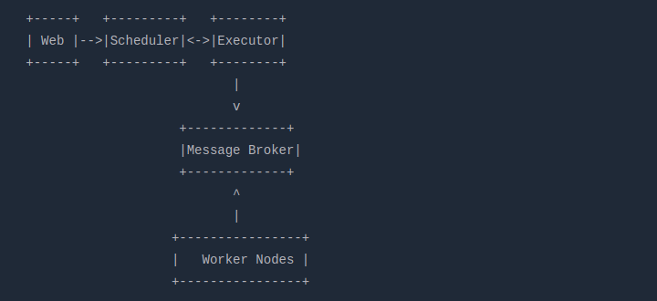
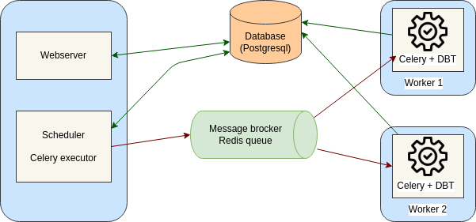

# How to Scale-out Apache Airflow 2.7 with PostgreSQL, Redis and Celery:

This repository contains deployment of Apache Airflow 2.7 with PostgreSQL, Redis and Celery using docker compose.  

## Informations:  

    * Based on Python 3.8 and uses the official postgresql as backend database and Redis as queue.  
    * Install docker and docke compose.  

## Airflow architecture:  

Before we begin, let’s talk about the architecture I used. In my case, I use 1 master node and 2 worker nodes. Webserver, scheduler, metadata database, and message broker are deployed to master node, while the workers are deployed to each worker nodes.  
Here is a simplified representation of the architecture:  

The architecture of the Airflow Celery Executor consists of several components, listed below:  

**Workers:** Its job is to execute the assigned tasks by Airflow Celery.  
**Scheduler:** It is responsible for adding the necessary tasks to the queue.  
**Database:** It contains all the information related to the status of tasks, DAGs, Variables, connections, etc.  
**Web Server:** The HTTP server provides access to information related to DAG and task status.  
**Celery:** Queue mechanism.  
**Broker:** This component of the Celery queue stores commands for execution.   

  

## docker-compose-airflow  

_Note: Updated to Airflow version 2.7.0_  

Docker Compose Apache Airflow (Official Docker Images) with CeleryExecutor, InitDB and InitUser  

Ideal for small/medium aiflow deployments.  

### Features  
- Add any linux packages to image.  
- Add python libraries to the image.  

### How to deploy:  
 
**Prerequisite**: Docker and docker-compose to be installed.   

**Step 1:** Clone this Repo and open terminal.  

**Step 2:** Go through .env file, init_airflow_setup.sh, docker-compose.yml file to change settings according to your preference. Or you can just keep them as it is for local development.  

**Step 3:** Run `docker-compose up -d`  

**Step 4:** Run `sh init_airflow_setup.sh` (Run this only for initial deployment)  

**Step 5:** Go to http://localhost:8080 and login with user: admin and password: password12345 as specified in init_airflow_setup.sh script  

**Step 6:** Run few dags and monitor Celery workers at http://localhost:5555  

Now you’re ready to start using this powerful tool and orchestrating workflows.  

### Debug:  

docker exec -ti airflow_webserver_cont /bin/bash  

airflow db init  

docker exec -ti postgresql_cont /bin/bash  

psql -d airflow -U postgres  

\l  

SELECT *  FROM pg_user;  

ALTER USER postgres WITH PASSWORD 'postgres';  

To destroy the stack:  
stop, remove all container and remove all images :  

`docker-compose down --remove-orphans --rmi all`

